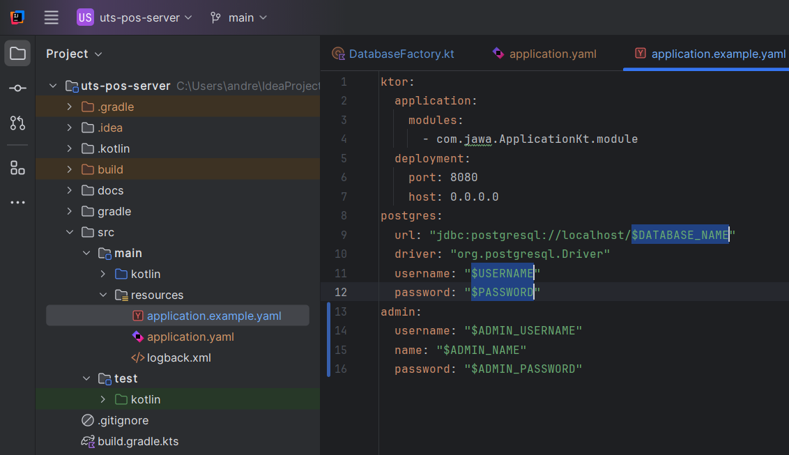
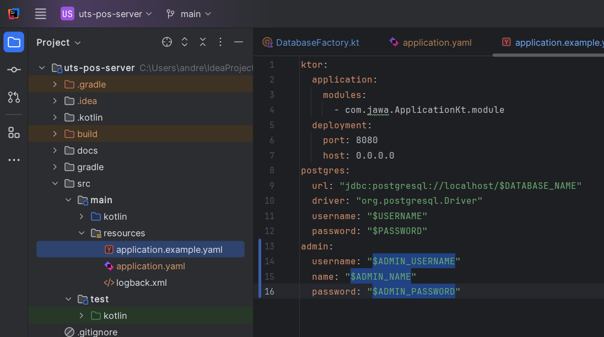

# Server POS Jawa (Ktor)

[CATATAN APLIKASI UNTUK PENGEMBANG](docs/NOTES.md)

## Table of Content

- [Requirements](#requirements)
- [How to use](#how-to-use)

## Requirements

- **PostgreSQL 17 or Later**

  [Download here](https://www.postgresql.org/download/windows/)

- **Java Development Kit (JDK) 20 or later**

  [Download here](https://www.oracle.com/java/technologies/javase/jdk20-archive-downloads.html) or IntelliJ will download it automatically

- **Gradle 8.8 or later**

  [Download here](https://gradle.org/releases/) or IntelliJ will download it automatically

- **Kotlin 2.0 or later**
    
    IntelliJ will download it automatically

## How To Use

### 1. IntelliJ IDEA

1. Create new empty database in PostgreSQL
    ```postgresql
    CREATE DATABASE db_name;
    ```
2. Modify [**application.example.yaml**](src/main/resources/application.example.yaml) in `/src/main/resources/` with your own database configuration (DATABASE_NAME, USERNAME, PASSWORD)
    
3. Modify [**application.example.yaml**](src/main/resources/application.example.yaml) in `/src/main/resources/` with your own default admin configuration (USERNAME, NAME, PASSWORD)
   
4. Rename the file name [**application.example.yaml**](src/main/resources/application.example.yaml) to **application.yaml** 
5. Run server
5. Run **[client application](https://github.com/andreasmlbngaol/uts-pos-client)**