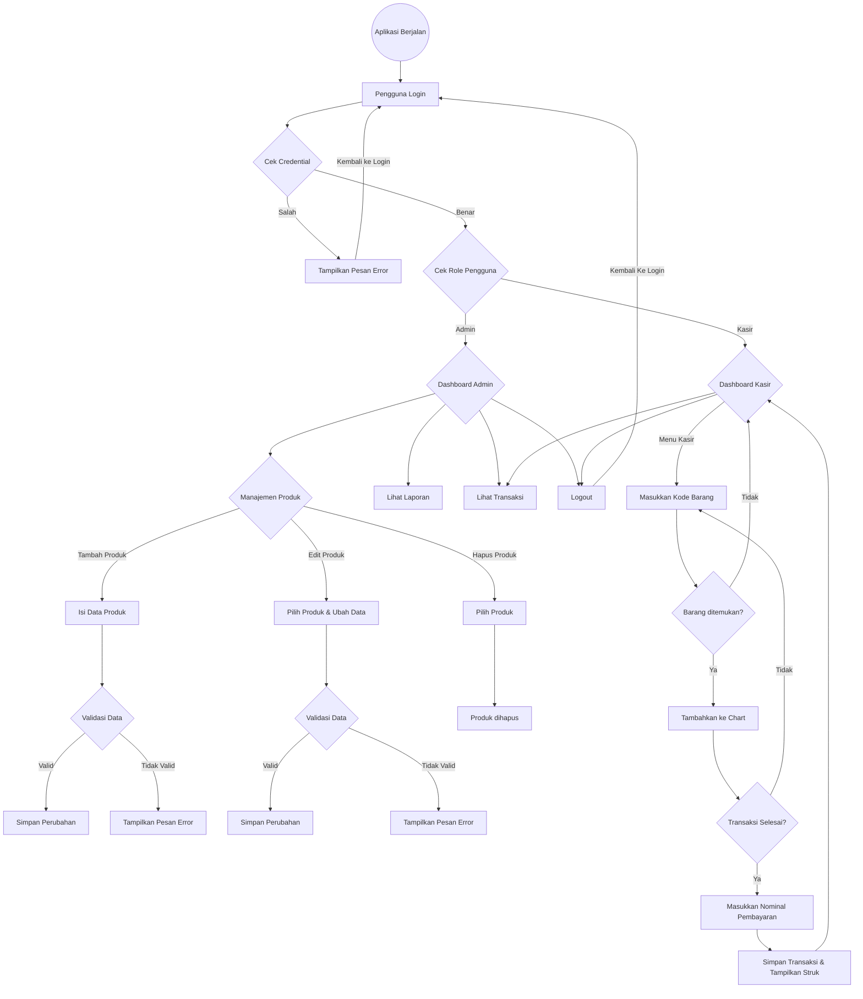

# Dokumentasi POS Jawa

[CATATAN APLIKASI](https://docs.google.com/document/d/163Xaw4dyt2KEffbyFco3wXHCG550_AlHfQ6lX7ueeKw/edit?usp=sharing)

## Diagram Alur Aplikasi



---

## Struktur Database

### Tabel `users`

Menyimpan data pengguna seperti admin dan kasir.

#### Relasi:
- **One-to-Many** dengan `transactions`: Satu pengguna (kasir) bisa melakukan banyak transaksi.

#### Struktur Tabel:

| Nama Kolom   | Tipe Data                 | Keterangan                  |
|--------------|---------------------------|-----------------------------|
| id           | BIGSERIAL (Primary Key)   | ID unik pengguna            |
| username     | VARCHAR(255) **(Unique)** | Username pengguna (unik)    |
| passwordHash | VARCHAR(255)              | Password yang sudah di-hash |
| role         | ENUM('ADMIN', 'CASHIER')  | Peran pengguna              |

#### Kode Exposed:

```kotlin
object Users : LongIdTable() {
    val username = varchar("username", 255).uniqueIndex()
    val passwordHash = varchar("password_hash", 255)
    val role = enumerationByName("role", 10, Role::class)
}
```

### Tabel `products`

Menyimpan data barang yang dijual.

#### Relasi:
- **One-to-Many** dengan `transaction_details`: Satu produk bisa masuk ke banyak transaksi.

#### Struktur Tabel:

| Nama Kolom | Tipe Data               | Keterangan         |
|------------|-------------------------|--------------------|
| id         | BIGSERIAL (Primary Key) | ID unik produk     |
| name       | VARCHAR(255)            | Nama produk        |
| price      | DOUBLE PRECISION        | Harga produk       |
| stock      | INTEGER                 | Jumlah stok produk |

#### Kode Exposed:

```kotlin
object Products : LongIdTable() {
    val name = varchar("name", 255)
    val price = double("price")
    val stock = integer("stock")
}
```

### Tabel `transactions`

Menyimpan data transaksi yang dilakukan oleh kasir.

#### Relasi:
- **Many-to-One** dengan `users`: Banyak transaksi dilakukan oleh satu kasir.
- **One-to-Many** dengan `transaction_details`: Satu transaksi bisa memiliki banyak item produk.

#### Struktur Tabel:

| Nama Kolom | Tipe Data                           | Keterangan                        |
|------------|-------------------------------------|-----------------------------------|
| id         | BIGSERIAL (Primary Key)             | ID unik transaksi                 |
| userId     | BIGINT (Foreign Key to `users`.id)  | ID kasir yang melakukan transaksi |
| amount     | DOUBLE PRECISION                    | Total harga transaksi             |
| timestamp  | TIMESTAMP DEFAULT CURRENT_TIMESTAMP | Waktu transaksi                   |

#### Kode Exposed:

```kotlin
object Transactions : LongIdTable() {
    val userId = reference("user_id", Users)
    val totalAmount = double("total_amount")
    val timestamp = datetime("timestamp").defaultExpression(CurrentDateTime)
}
```

---

## Endpoint API

### Format Response

- **Sukses (List Data):**
    ```json
    [
      { "id": 1, "name": "Indomie Goreng", "price": 3000 },
      { "id": 2, "name": "Aqua 600ml", "price": 4000 }
    ]
    ```

- **Sukses (Data Tunggal):**
    ```json
    { "id": 1, "name": "Indomie Goreng", "price": 3000 }
    ```

- **Gagal (Error):**
    ```json
    {
      "status": "Not Found",
      "message": "Product with ID 1 not found"
    } 
    ```

### Authentication API

| Method | Endpoint       | Akses  | Deskripsi                     |
|--------|--------------|--------|-------------------------------|
| POST   | `/auth/login`  | Public | Login dengan email & password |
| POST   | `/auth/logout` | Public | Logout, menghapus session     |

### User API

| Method | Endpoint      | Akses | Deskripsi                                   |
|--------|--------------|-------|---------------------------------------------|
| GET    | `/users`      | Admin | Melihat daftar pengguna                     |
| GET    | `/users/{id}` | Admin | Melihat pengguna dengan ID tertentu         |
| POST   | `/users`      | Admin | Menambahkan pengguna baru                   |
| PUT    | `/users/{id}` | Admin | Mengupdate data pengguna dengan ID tertentu |
| DELETE | `/users/{id}` | Admin | Menghapus pengguna dengan ID tertentu       |

### Product API

| Method | Endpoint         | Akses  | Deskripsi                             |
|--------|----------------|--------|---------------------------------------|
| GET    | `/products`      | Public | Melihat daftar produk                |
| GET    | `/products/{id}` | Public | Melihat produk dengan ID tertentu    |
| POST   | `/products`      | Admin  | Menambahkan produk baru              |
| PUT    | `/products/{id}` | Admin  | Mengupdate produk dengan ID tertentu |
| DELETE | `/products/{id}` | Admin  | Menghapus produk dengan ID tertentu  |

### Transaction API

| Method | Endpoint             | Akses  | Deskripsi                              |
|--------|---------------------|--------|----------------------------------------|
| GET    | `/transactions/{id}` | Public | Melihat transaksi dengan ID tertentu  |
| POST   | `/transactions`      | Kasir  | Membuat transaksi baru                 |

### Report API

| Method | Endpoint                   | Akses | Deskripsi                                                |
|--------|---------------------------|-------|----------------------------------------------------------|
| GET    | `/reports/daily/{date}`    | Admin | Melihat laporan penjualan harian dengan tanggal tertentu |
| GET    | `/reports/monthly/{month}` | Admin | Melihat laporan penjualan bulanan dengan bulan tertentu  |

